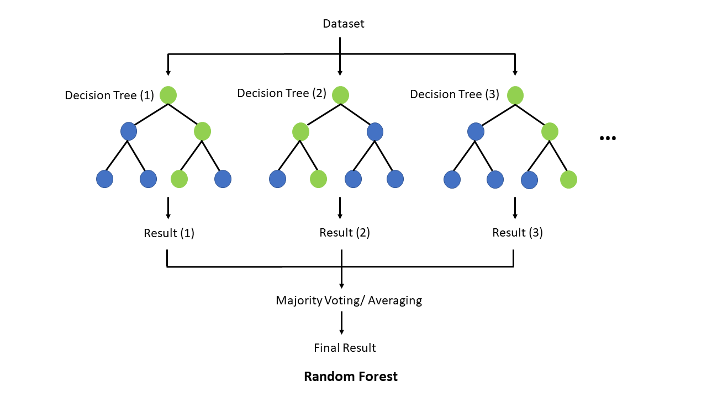

<p align="center">
  
</p>

<h1 align="center">Glunova AI</h1>

<p align="center">
  <b>A clinical decision-support web server for Gestational Diabetes Mellitus</b><br>
  Developed at the Integrative Omics and Molecular Modelling Lab
</p>

<p align="center">
  
  
  
  
  
</p>

---

## Overview

Gestational Diabetes Mellitus (GDM) is one of the most common metabolic
complications of pregnancy. Identifying it early allows timely dietary,
lifestyle and medical management.

**Glunova AI** assesses maternal GDM status from data that are already
collected during routine antenatal care:

- demographic and obstetric history
- anthropometry
- blood pressure
- fasting plasma glucose
- the complete blood count

The tool was developed as part of a research study on machine-learning-based
prediction of GDM. It makes the final Random Forest model openly available
through a simple web interface.

For each mother, Glunova AI reports one of two outcomes:

| Outcome | Meaning |
|---|---|
| **YES** | GDM predicted |
| **NO**  | GDM not predicted |

A probability or risk score is not reported.

---

## Features

- **Patient Assessment:** record 14 routine antenatal parameters for one
  mother and see her outcome immediately.
- **Cohort Assessment:** assess an entire antenatal clinic list or study
  cohort from one spreadsheet (CSV), and download the results.
- **Handles incomplete records:** missing laboratory values are estimated
  with the imputation model fitted during the derivation study.
- **Exportable reports:** individual and cohort assessments can be
  downloaded as CSV files.
- **Transparent methodology:** the model, data handling and clinical data
  dictionary are documented in the application.
- **Open access:** no account or login is required.

---

## Clinical Parameters

The model uses 14 parameters, grouped into three clinical domains.

| Domain | Parameter | Unit |
|---|---|---|
| Demographic & obstetric | Maternal age | years |
| | Gravidity | count |
| | Family history of diabetes | Yes / No |
| | Blood group | A, B, AB, O |
| | Body mass index (BMI) | kg/m² |
| Clinical & biochemical | Mean systolic blood pressure | mmHg |
| | Mean diastolic blood pressure | mmHg |
| | Fasting plasma glucose | mg/dL |
| Haematological (CBC) | Haemoglobin (Hb) | g/dL |
| | Red blood cell count (RBC) | millions/mL |
| | White blood cell count (WBC) | ×10³/µL |
| | Mean corpuscular haemoglobin concentration (MCHC) | g/dL |
| | Absolute lymphocyte count | ×10³/µL |
| | Absolute eosinophil count | ×10³/µL |

After blood group is encoded (AB and B, with O and A as reference), the model
receives **15 features**.

---

## Machine Learning Algorithm

<p align="center">
  
</p>

Glunova AI uses a **Random Forest**, an ensemble of decision trees. Each tree
is trained on a different sample of the study cohort. For a new maternal
profile, every tree gives its own assessment, and the reported outcome is
their **majority vote**.

Each record passes through the same data-handling steps used during model
development:

1. **Encoding** of blood group.
2. **Estimation of missing values** with the iterative imputer fitted on the
   training data.
3. **Log transformation** of skewed laboratory parameters.
4. **Selection** of the final model features, in the order used for training.

During model development, class imbalance between GDM-positive and
GDM-negative mothers was addressed with **SMOTEENN** resampling.

---

## Installation

**Requirements:** Python 3.11 and Git. Conda is recommended.

```bash
git clone https://github.com/sajjadtahreem/Glunova-AI.git
cd Glunova-AI

conda create -n glunova python=3.11 -y
conda activate glunova

python -m pip install -r requirements.txt
```

## Running the Application

From inside the `Glunova-AI` folder, run:

```bash
streamlit run app.py
```

The application opens at **http://localhost:8501**. Press `Ctrl + C` in the
terminal to stop it.

To make the application reachable from other computers on the same network,
run:

```bash
streamlit run app.py --server.address 0.0.0.0
```

### Cohort Assessment Input

Download the **data collection template** from the Cohort Assessment page.
Enter one mother per row, with these column headers:

```text
Maternal age, Gravidity, Family History of Diabetes, Mean Diastolic BP,
Mean Systolic BP, Fasting Glucose (mg/dl), Hb (g/dl), RBC (millions/ml),
WBC (10^3/uL), MCHC (g/dl), Lymphocytes (Absolute count 10^3/uL),
Eosinophils (Absolute count 10^3/uL), BMI, Blood Type
```

- `Family History of Diabetes`: `1` (yes) or `0` (no)
- `Blood Type`: `A`, `B`, `AB` or `O`

---

## Repository Structure

```text
Glunova-AI/
├── app.py                     # Streamlit application (interface + assessment logic)
├── requirements.txt           # Python dependencies
├── model/
│   ├── model.pkl              # Trained Random Forest pipeline
│   └── gdm_preprocessor.pkl   # Imputer, encoding and feature definitions
├── assets/
│   ├── images/                # Logo, GDM illustration, Random Forest figure
│   ├── slides/                # Home-page slideshow images
│   ├── partners/              # Collaborating hospital logos
│   └── team/                  # Team photographs
├── .streamlit/
│   └── config.toml            # Theme configuration
├── LICENSE
└── README.md
```

---


## Authors

**Tahreem Sajjad**  
*Integrative Omics and Molecular Modelling Lab, Department of Bioinformatics and Biotechnology, Government College University Faisalabad (GCUF), Faisalabad, Pakistan*  
Email: [tahreemsajjad1072@gmail.com](mailto:tahreemsajjad1072@gmail.com)

**Mr. Rana Sheraz Ahmad**  
*Integrative Omics and Molecular Modeling Laboratory, Department of Bioinformatics and Biotechnology, Government College University Faisalabad (GCUF), Faisalabad, 38000, Pakistan*  
Email: [rana.a@lums.edu.pk](mailto:rana.a@lums.edu.pk)

**Dr. Muhammad Tahir ul Qamar** *(Correspondence)*  
*Integrative Omics and Molecular Modeling Laboratory, Department of Bioinformatics and Biotechnology, Government College University Faisalabad (GCUF), Faisalabad, 38000, Pakistan*  
Email: [m.tahirulqamar@hotmail.com](mailto:m.tahirulqamar@hotmail.com)

---

---


## Intended Use

> **Research use only.** Glunova AI is intended for research and educational
> purposes. It is not a medical device and does not replace diagnosis of GDM
> according to established clinical criteria, or the judgement of a qualified
> healthcare professional.

Values you enter and files you upload are processed only to generate the
assessment. The application does not store them.

---

## Citation

If Glunova AI supports your research, please acknowledge the
**Integrative Omics and Molecular Modelling Lab**. A formal citation will be
added here once the associated study is published.

---

## License

This project is released under the [MIT License](LICENSE).

<p align="center">
  © 2026 Glunova AI · Integrative Omics and Molecular Modelling Lab
</p>
